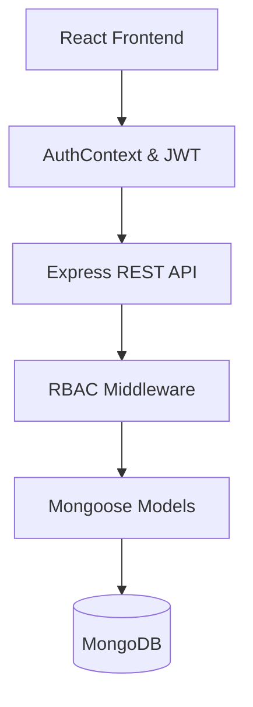

A **full-stack Learning Management System (LMS)** built using the **MERN stack** that enables instructors to create and manage courses, and students to enroll, learn, and track progress through a secure, role-based platform.

---

## 🚀 Features

### 🔐 Authentication & Authorization

* Secure user registration and login using **JWT**
* Password hashing with **bcrypt**
* **Role-Based Access Control (RBAC)** for:

  * Student
  * Instructor
  * Admin
* Protected backend APIs and frontend routes

### 📚 Course Management

* Instructors can:

  * Create, update, publish/unpublish courses
  * Organize courses into modules and lessons
  * Edit lesson content (title, description, video URL)
  * Reorder curriculum using drag-and-drop
* Students can:

  * Browse published courses
  * Enroll and track learning progress

### 🧩 Curriculum Structure

* Course → Modules → Lessons hierarchy
* MongoDB document relationships using **Mongoose references**
* Scalable, normalized data modeling

### ⚛️ Frontend Architecture

* Built with **React + Vite**
* Global authentication state using **React Context API**
* Custom `useApi` hook with **SWR** for:

  * Data fetching
  * Caching & revalidation
  * Error and loading state management
* Route protection for authenticated and role-specific views

### 🛡️ Security & Best Practices

* JWT authentication middleware
* Role validation middleware
* Input validation & centralized error handling
* Secure API design following REST conventions

---

## 🧠 System Architecture Overview



---

## 🗂️ Project Structure

### Backend

```
backend/
├── src/
│   ├── controllers/
│   ├── models/
│   ├── routes/
│   ├── middlewares/
│   ├── utils/
│   └── server.js
```

### Frontend

```
frontend/
├── src/
│   ├── components/
│   ├── context/
│   ├── hooks/
│   ├── api/
│   └── App.jsx
```

---

## 🛠️ Tech Stack

| Layer            | Technology                          |
| ---------------- | ----------------------------------- |
| Frontend         | React, Vite, Tailwind CSS           |
| Backend          | Node.js, Express.js                 |
| Database         | MongoDB, Mongoose                   |
| Auth             | JWT, bcrypt                         |
| State Management | React Context API                   |
| Data Fetching    | SWR                                 |
| Deployment       | Vercel (Frontend), Render (Backend) |

---

## 🔄 API Highlights

| Endpoint                   | Method | Access           |
| -------------------------- | ------ | ---------------- |
| `/api/auth/register`       | POST   | Public           |
| `/api/auth/login`          | POST   | Public           |
| `/api/courses`             | GET    | Public           |
| `/api/courses`             | POST   | Instructor/Admin |
| `/api/courses/:id/modules` | POST   | Instructor/Admin |
| `/api/modules/:id/lessons` | POST   | Instructor/Admin |
| `/api/enrollments/me`      | GET    | Student          |

---

## 🔐 Role-Based Access Control (RBAC)

| Role       | Permissions              |
| ---------- | ------------------------ |
| Student    | View & enroll in courses |
| Instructor | Create & manage courses  |
| Admin      | Full system access       |

RBAC is enforced on:

* **Backend** using middleware
* **Frontend** using route guards and conditional rendering

---

## 🧪 Key Learning Outcomes

* Built a **secure full-stack application**
* Implemented **JWT authentication & RBAC**
* Designed **scalable MongoDB schemas**
* Developed **custom reusable React hooks**
* Applied **clean architecture & separation of concerns**
* Implemented **real-world LMS workflows**

---

## ⚙️ Setup Instructions

### 1️⃣ Clone Repository

```bash
git clone https://github.com/rockstarrk04/lms_using_mern.git
cd lms_using_mern
```

### 2️⃣ Backend Setup

```bash
cd backend
npm install
npm run dev
```

Create `.env` file:

```env
MONGO_URI=your_mongodb_url
JWT_SECRET=your_jwt_secret
```

### 3️⃣ Frontend Setup

```bash
cd frontend
npm install
npm run dev
```

---

## 📈 Future Enhancements

* Payment gateway integration
* Certificate generation
* Video streaming optimization
* Admin analytics dashboard
* AI-based course recommendations

---
📧 Contact via GitHub

---

## ⭐ If you like this project

Please consider giving the repository a **star ⭐** — it helps a lot!

---
