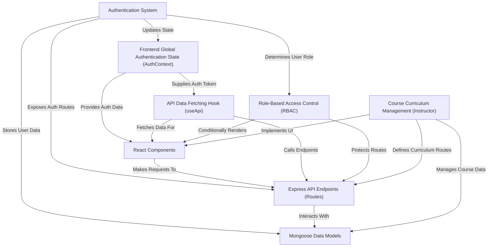

# Tutorial: lms_using_mern

This project is a **Learning Management System (LMS)** that allows users to *register as students or instructors*, enroll in courses, and learn online. Instructors can *create and manage their course content*, while students can track their progress. It features a robust **authentication system** to secure user accounts and a *role-based access control* mechanism to differentiate user permissions, ensuring a personalized and secure learning environment.

## Visual Overview

## Chapters

1. [Mongoose Data Models
](01_mongoose_data_models_.md)
2. [Express API Endpoints (Routes)
](02_express_api_endpoints__routes__.md)
3. [Authentication System
](03_authentication_system_.md)
4. [Role-Based Access Control (RBAC)
](04_role_based_access_control__rbac__.md)
5. [Frontend Global Authentication State (AuthContext)
](05_frontend_global_authentication_state__authcontext__.md)
6. [API Data Fetching Hook (`useApi`)
](06_api_data_fetching_hook___useapi___.md)
7. [React Components
](07_react_components_.md)
8. [Course Curriculum Management (Instructor)
](08_course_curriculum_management__instructor__.md)
